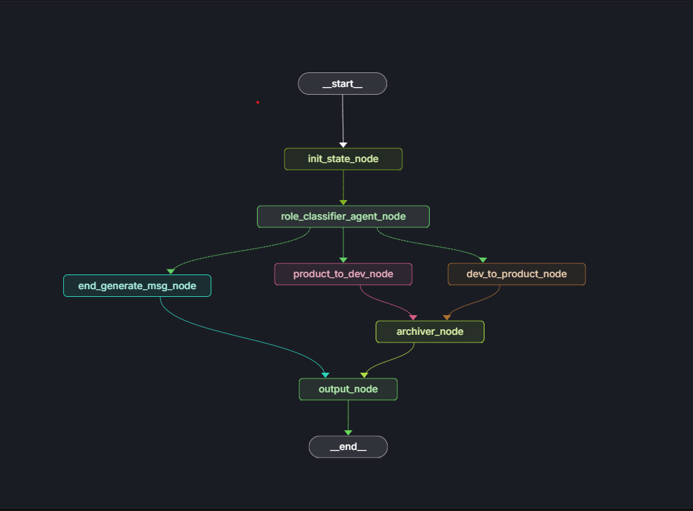

# DOC

## 如何运行 V0.2

> 配置 `.env` 文件中的环境变量。需要设置 `OPENAI_BASE_URL` 和 `OPENAI_KEY`，本项目使用 ChatGPT OpenAI 的 key 进行开发。
> 在 `.env` 中配置 `CHAT_MODEL_NAME="gpt-4.1"` 指定模型名称。
> `.env` 中的 `ZHIPU_API_KEY` 暂时可以忽略，后续计划使用 GLM 的网络搜索功能。

### 自动安装/运行

如果在类 Linux 环境下，可以执行 init.sh 脚本安装依赖，执行 run.sh 脚本启动前后端服务。

由于环境差异，sh 脚本并不能覆盖所有终端，如果出现问题请尝试手动安装/运行。

---

### 手动安装/运行

#### 后端

0. 配置 `.env` 文件中的环境变量。
1. 项目使用 `uv` 进行管理，如果没有全局安装 `uv`，请先安装 uv。
2. 使用 `uv sync` 同步依赖。
3. 使用 `uv run` 启动 langsmith 的服务。
4. 使用 `uvicorn src.service.main:app --reload` 运行 service 服务。

如果只想运行 agent，可以使用 `langgraph dev` 启动 langsmith 的开发服务。

#### 前端

1. `cd ./src/web` 
2. `npm install` 安装依赖
3. `npm run start` 启动 web 服务

## 简介

### 技术栈

- 后端：使用 Python 的 FastAPI 作为后台服务，用于接收用户请求和 agent 调用
- Agent：使用 langchain/langgraph 进行开发，使用 openai 进行模型调用，使用 sqlite 进行本地存储
- 前端：使用 React 进行开发，使用 react-query 进行数据请求，使用 localforage 做 indexDB 存储

### 文档说明

目录内包含以下几份文档：

1. `docs/AGENTS.md`：Agent 开发文档
2. `docs/QUESTION.md`：需求文档
3. `docs/SOLUTION.md`：AI 生成的解决方案（仅供参考，在解决问题的过程中可能存在偏差，因此该文档具有一定滞后性）
4. `docs/TODO.md`：待办事项

### 项目描述

由于本人较少编写 Python 代码，因此在开发过程中花费了大量时间处理 `python` 代码以及 `langchain/langgraph` 相关问题，python代码设计上可能不符合市场规范，包括服务器和前端写的都过于简陋了，请见谅。

大部分当前想要实现但尚未完成的功能都记录在 `TODO.MD` 中。

目前存在的主要问题：

- **服务架构问题**：Agent 应该独立部署为一个服务，然后由服务端调用。但我直接在服务端实例化了一个 workflow 并直接调用。

- **流式输出问题**：原本计划添加流式输出功能，但 SSE 的使用方式存在问题。理想情况下应采用 `sse + http post` 组合，其中 SSE 用于下发数据，HTTP POST 用于上传数据，通过 thread_id 形成订阅/更新机制。但由于时间有限，目前的 SSE 既用于更新数据又用于返回数据。

- **前端职责过重**：前端承担了 thread_id 的生成、管理和历史消息的存储等功能。这种做法并不合理，这些功能应由后端负责。此外还缺少许多校验机制，如 thread_id 所属用户验证、消息恢复等功能，由于时间不足未能实现。

- **模型与提示词优化不足**：Agent 的模型和提示词都未经优化，提示词是通过 AI 生成的，但缺乏细致的优化和模型选择的匹配。

- **模型适配性**：面对不同任务，选用不同的模型和服务会带来更好的用户体验，但没有时间进行相关尝试和更换。

### Agent Graph

上图为整个 graph 的流程图，`src/agent/graph_components` 中的节点都可以在对应目录中找到，大部分都已添加简单注释。

~~## 如何运行 V0.1~~

~~1. 项目使用 `uv` 进行管理，如果没有全局安装 `uv`，请先安装 uv。~~
~~2. `uv sync` 同步依赖~~
~~3. `langgraph dev` 启动 langsmith 的开发服务（后期将替换为 RESTful API 服务）~~
~~4. 在浏览器中访问 `https://smith.langchain.com/studio/?baseUrl=http://127.0.0.1:2024`~~
~~5. 在网页中 `Input` 的 `User Input` 中输入用户内容，点击 `Submit` 按钮 -->~~