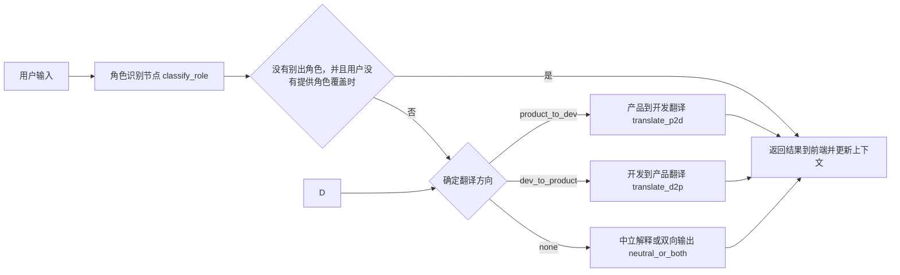

## 一、整体目标与约束

### 1. 角色识别的目标

针对**每一条用户输入**，AI 完成两件事：

1. 判定**视角角色**：
   - `product`：产品视角
   - `developer`：开发视角
   - `leader`：混合视角，既有产品也有技术点,作为领导视角，他可以接受两个方向的输入和输出
   - `unknown`：难以判断
2. 推导**推荐翻译方向**：
   - `product_to_dev`
   - `dev_to_product`
   - `mixed`:混合视角，既包含产品，又包含技术点
   - `none`

并给出：
- `confidence`：0~1 置信度
- `reason`：简要说明为什么这么判定

### 2. 人机协作约束

- **AI 负责给出默认判断和默认翻译方向**；
- **UI 允许用户一键纠正角色 / 方向**，纠正后的设置**优先级最高**；
- 后端会记住用户的纠正，用于当次会话内的**轻微加权**，但不会强行锁死角色（避免用户偶尔切换视角时被历史信息“绑架”）。

---

## 二、Agent 高层流程设计

### 1. 会话内的数据流

用一个简化的时序流程表示：



核心节点：
- `classify_role`：如果初始化没有分类的，调用大模型进行角色分类；
- `apply_user_override`：如果 UI 提供 override，如果在AI判断模糊的情况下，采用apply_user_override；
- `route_translation`（图中合在 F 节点里）：根据最终角色/方向路由到具体翻译节点；
- `translate_p2d` / `translate_d2p`：两套不同的提示词与输出结构；
- `neutral_or_both`：对 `mixed` / `unknown` 场景给兜底策略。

---

## 三、角色分类模块设计（重点）

### 1. 分类标签与逻辑

输出结构建议统一为一个 JSON,使用langgraph中结构化输出`with_structured_output`。：

```json
{
  "role": "product | developer | leader | unknown",
  "direction": "product_to_dev | dev_to_product | mixed | none",
  "confidence": 0.0,
  "reason": "简要自然语言说明"
}
```

基本规则：
- 当 `role = product` 时，默认 `direction = product_to_dev`；
- 当 `role = developer` 时，默认 `direction = dev_to_product`；
- 当 `role = leader` 时，默认 `direction = mixed`，表示同时需要面向产品和开发的双向视角输出；
- 当 `role = unknown` 时，`direction = none`，交由后续节点决定是否提示用户补充信息或手动选择角色。

---

## 四、LangGraph 中的状态与节点设计

### 1. State 结构建议

在现有的对话 State（例如有消息列表、模型配置等）基础上，新增几个字段（用伪结构表示）：

```python
state = {
  "user_input": str,                # 当前这一轮输入
  "role_inferred": "product|developer|leader|unknown|null",
  "role_confidence": float | null,
  "direction_inferred": "product_to_dev|dev_to_product|mixed|null",
  "role_override_by_user": "product|developer|leader|null",   # 用户 UI 强制指定角色
  "final_role": "product|developer|leader|unknown|null",       # route 前统一好的角色
  "final_direction": "product_to_dev|dev_to_product|mixed|none|null" # route 前统一好的方向
}
```

要点：
- `*_override_by_user` 由前端在用户点击切换时写入；
- 在一个小的“决策节点”里，统一计算 `final_role` 和 `final_direction`，后面的翻译节点只看这两个字段。

### 2. 新增 / 拆分节点

在图中增加或拆分如下一些节点（逻辑层面）：

1. `classify_role`（LLM 调用节点）
   - 输入：`user_input` + 可选上下文
   - 输出：`role_inferred`, `role_confidence`, `direction_inferred`
   - 如果`role_confidence`< 0.5 并且`role_override_by_user = none`，则不继续推理，直接告知用户缺少判断消息，继续输入消息或者手动点击切换角色
2. `apply_user_override`（普通 Python 函数节点）
   - 逻辑：
     - 如果 `role_confidence< 0.5` 并且 `role_override_by_user != none`，则 `final_role = role_override_by_user` `final_direction`同理；
     - 如果 `role_confidence >= 0.5`，则 `final_role = role_inferred` `final_direction`同理；
3. `route_translation`（条件路由节点）
   - 依据 `final_direction`：
     - `product_to_dev` → `translate_p2d`
     - `dev_to_product` → `translate_d2p`
     - `none` 或 `mixed` → `neutral_or_both`
4. `translate_p2d` / `translate_d2p`（LLM 翻译节点）
   - 分别使用不同的系统提示词，强调对方关心点，补全缺失信息；
5. `neutral_or_both`
   - 对低置信度或 `mixed` 的场景：
     - 方案 A：输出一份“中立解释”，既说明产品视角也说明技术视角；
     - 方案 B：直接给出两个 block：给产品看的翻译 + 给开发看的翻译。

---

## 五、三套翻译提示词设计（判断身份 / 产品→开发 / 开发→产品）

### 1. 角色分类（role_classifier，重点）

**目标：** 确定输入是**产品经理**还是**开发工程师**。

提示词重点约束：

- 要清晰定义四类角色 `product` / `developer` / `leader` / `unknown` 的典型关注点和说话习惯，例如：
  - 产品更关注用户价值、业务目标、功能需求、数据指标等；
  - 开发更关注技术实现、复杂度、风险、性能、接口与数据结构等；
  - 领导更关注整体目标、资源投入与收益、优先级和平衡各方诉求；
- 明确当前任务是**分类**，禁止编造输入中不存在的事实，只能基于提供的文本和上下文做判断；
- 需要综合考虑【当前输入】、【最近对话摘要】以及【可选信息】中的历史角色：
  - 优先级建议为：当前输入 > 用户手动选择的角色 > 历史模型判断；
- 对 `leader` 视角给出明确判定标准：既关心业务结果又会考虑技术可行性、成本和风险，经常讨论排期、资源、里程碑；
- 当难以区分或信息严重不足时，应输出 `role = unknown`，并将 `confidence` 设为 0.5 以下；
- 输出必须严格符合给定 JSON schema，只返回一段合法 JSON，字段名和枚举值不得修改，不要输出额外解释文本。

输出可以类似：

```json
{
  "role": "product",
  "direction": "product_to_dev",
  "confidence": 0.82,
  "reason": "输入主要描述要做的功能和希望提升的业务指标, 没有涉及具体技术实现细节, 更符合產品經理視角"
}
```

### 2. 产品 → 开发（product_to_dev）

**目标：** 把模糊/抽象的产品表述变成开发可执行的**半技术方案草图**。

提示词重点约束：

- 要求输出结构化的分点说明，建议结构：
  - 背景与目标
  - 功能描述（用开发能实现的界面 / API 视角表述）
  - 推荐技术方向（如：推荐算法类型、数据来源、技术栈大类）
  - 数据与依赖：所需数据表/日志/第三方服务
  - 性能与实时性要求（如需要实时推荐 OR 每日批处理）
  - 风险与不确定点（需要和产品进一步澄清的点）
  - 粗略工作量评估（如：S/M/L + 简要原因）
  - 推荐算法类型建议（协同过滤/内容推荐等）
- 指导模型：
  - **不要假装有数据**，对于未知的细节要显式列出“需要向产品确认的问题”；
  - 避免写成完整设计文档，只需“开发评审会前的方案雏形”。

输出可以类似：

```text
一、业务目标与背景
- ...

二、功能范围与用户流程
- ...

三、技术实现建议
- 方案方向: ...
- 推荐算法: ...
- 数据来源: ...

四、性能与系统要求
- ...

五、待确认问题
- ...

六、工作量评估
- ...
```

### 3. 开发 → 产品（dev_to_product）

**目标：** 把技术更新翻译成产品/业务可理解的**影响说明**。

提示词重点约束：

- 输出结构建议：
  - 对用户体验的影响（加载时间、推荐质量、稳定性等）
  - 对业务指标的潜在影响（转化、留存、使用频次、成本）
  - 对运营 / 业务侧可用的新能力
  - 对风险、限制和前提条件的说明
- 提醒模型：
  - 尽量避免堆砌技术名词，出现专业词汇要给一句通俗解释；
  - 可以用简单类比帮助产品理解；
  - 如果技术改动对产品暂时“无感”，也要诚实说明，同时指出**为什么这对长期有价值**（如可观测性、可维护性、成本等）。

输出可以类似：

```text
一、对用户体验的影响
- 页面加载时间预计缩短约 X 秒, 用户等待感会明显减弱
- 高峰期接口超时率下降后, 用户遇到报错提示的频率会降低, 使用过程更顺畅

二、对业务指标的潜在影响
- 在现有流量不变的前提下, 转化率有望小幅提升 (例如 +1% ~ +3%), 需要配合 AB 实验验证
- 服务器资源利用率提升后, 同样的业务量可以使用更少的机器, 单次交易的基础设施成本会下降

三、带来的新能力
- 日志维度更加全面后, 运营同学可以做更细粒度的漏斗分析和问题排查
- 更稳定的接口性能为后续接入更多上层功能 (例如推荐、个性化排序) 打下基础

四、风险与限制
- 本次优化不会直接改变用户在界面上能看到的功能, 主要收益体现在质量和成本侧
- 上线初期需要重点关注监控中的 QPS、错误率和延迟指标, 如出现异常需要快速回滚
```

---

## 六、UI 交互设计：展示与一键纠正

### 1. 输入区

- 用户输入一段话，点击“翻译”；
- 选项：可以不强制用户选角色，默认走 AI 自动分类。

### 2. 结果顶部展示

在翻译结果区域顶部，显示类似：

- “系统推断：当前说话人视角是【产品】（置信度 0.82）”
- 右侧放几个按钮：
  - “我是产品”
  - “我是开发”
  - “我是领导”
  - “AI推导”
- 当前激活状态以高亮 / 勾选表示。

行为：
- 初次加载时，默认AI推导；
- 用户点击另一个角色按钮时：
  - 将新的 `role_override_by_user` 发送给后端；
  - 后端重新执行“决策 + 路由 + 翻译”节点（可只重跑翻译，不必重跑分类）；
  - UI 更新翻译结果。

### 3. 低置信度提示

- 当 `confidence &lt; 0.6` 或 `role = unknown` 时：
  - UI 可以标注：“系统对当前身份不确定，请选择你当前的角色”；

---

## 七、评估与回归测试方案

### 1. 样本构造

构建一个小数据集，包含几类句子：

- 典型产品表达（来自题目中例子 + 你自己的日常语料）；
- 典型开发表达（技术日志、PR 描述、技术讨论中的语句）；
- 模糊/混合表达（例如“这个接口实现起来会不会影响用户体验？”同时带产品和技术点）；
- 极短和无上下文的句子（如“这个能上线吗？”）用来测试 `unknown` 与低置信度策略。

标注字段：
- `gold_role`：人工判断角色（可只标 product/developer/leader）
- `input_text`

### 2. 自动评估

- 写一个简单的测试脚本，批量调用 `classify_role` 节点：
  - 统计准确率（只看 product/developer 样本），
  - 统计针对 `mixed`/`unknown` 的覆盖情况；
  - 观察 `confidence` 分布，用于调阈值（决定何时 UI 要求用户明确选择）。

### 3. 回归测试

- 当你调整 prompt 或模型版本时，运行该脚本：
  - 生成一次评估报告（如 JSON 或简单表格）；
  - 保证角色判定质量不会由于 prompt 调整而大幅退化。

---

## 八、落地实现建议（给后续 code 模式用）

为了让后续实现简单可控，建议按以下顺序在代码里落地（对应当前仓库结构）：

1. 在图谱文件 [`graph.py`](src/agent/graph.py) 中：
   - 扩展 State 结构，加入角色相关字段；
   - 定义 `classify_role` 节点（调用 LLM，强制 JSON 输出）；
   - 定义 `apply_user_override` 节点；
   - 实现一个简单的 `route_translation` 分支逻辑。
2. 定义两套翻译节点：
   - `translate_p2d`：加载产品→开发的系统 prompt 和输出格式；
   - `translate_d2p`：加载开发→产品的系统 prompt 和输出格式；
   - 后续可提取配置到单独的 prompts 配置文件。
3. 前端或 CLI：
   - 在请求参数中增加 `role_override_by_user` 和 `direction_override_by_user` 字段；
   - 在响应里返回：模型推断角色、置信度、最终使用的角色/方向；
   - UI 根据这些字段渲染角色徽标和切换按钮。
4. 编写一个简单的离线脚本：
   - 加载标注样本；
   - 通过 LangGraph 的入口一次性跑完 `classify_role`；
   - 输出评估统计。

以上方案完成后，你的 agent 就能：

- 默认自动判断“当前在说话的是产品还是开发”；
- 自动切换对应的翻译风格和关注点；
- 在 UI 层面让用户一键修正角色，并立刻影响翻译结果；
- 通过评估脚本持续检查角色识别质量，保证后续 prompt 调整可控稳定。